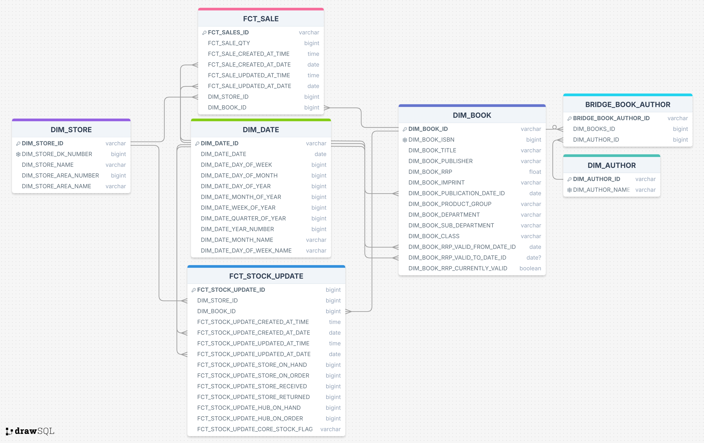
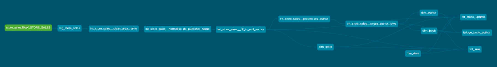
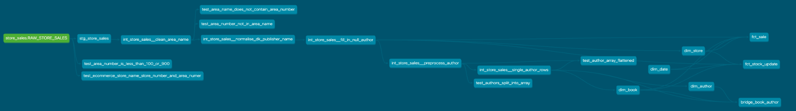

# Data modeling for DK analytics

---

## 🛠️ Prerequisites & Setup

Before you begin, ensure you have the following installed and configured:

* **Python**: A Python environment to run dbt.
* **Snowflake Account**: Access to a Snowflake account with a user, password, role, and warehouse.
* **SnowCLI**: Needed to run Snowflake commands from the terminal.

### 1. Create Snowflake environment and Load data into RAW table
After setting up SnowCLI and connecting it to your Snowflake account, run the two commands bellow from the root of this repository. These set up the Snowflake environment and then load data into an internal Snowflake stage and then copy this data into a RAW data table which is referenced by dbt.

`snow sql --connection <name_of_snowflake_connection> --filename snowflake_worksheets/create_environment.sql` -> Sets up the Snowflake role, warehouse, database, schemas and tables.

`snow sql --connection <name_of_snowflake_connection> --filename snowflake_worksheets/load_raw_data.sql` -> Created an internal stage and uploads the CSV to it. It then creates the `RAW_STORE_SALES` table in the `RAW` schema and copies the CSV data to this table.

### 2. Download dbt core and set up Python environment (commands are for MacOS)
Move to the `dbt_transform` directory and create a virtual environment. Activate the venv then download the requirements in the `requirements.txt` file.

`python3 -m venv .venv` -> Creates venv
`source .venv/bin/activate` -> Activates venv
`pip3 install -r requirements.txt` -> Downloads dependencies in venv

### 3. Run dbt models and generate dbt documentation
The dbt models created are explained in this read me, but alternatively you can create the documentation and host this locally.
First download dbt package dependencies. After this build all the models and if everything runs successfully then tables will materialise in the `ANALYTICS` schema as tables.

`dbt deps` -> Downloads the dbt packages
`dbt build` -> Builds and tests all the dbt models
`dbt docs generate` -> Generates documentation
`dbt docs serve` -> Serves the documentation on a local web server

---

##  🗄️ Final ERD diagram

The first part of the project was to understand the input data and the goal of the data modeling. **Table 1** was created to understand the columns in the `RAW` input data. The goal of the final data model is to allow the analytics team to easily query data in a efficient, clean and reliable manner. In turn this allows the analytics team to answer questions similar to "Which book titles are the highest-grossing in each store location?". This goal clearly aligns with an OLAP (Online Analytics Processing) data model due to the goal of analysis coupled with the fact a massive amount of data will be stored in the model.

| **COLUMN NAME** |                     **DESCRIPTION**                     |
|:----------------|:--------------------------------------------------------|
|CREATED_AT       |The date and time the data was processed *All the same so they could be batch imported*|
|UPDATED_AT|The date and time the record was last modified. Eg. payment status update or a return.|
|STORE_NUMBER|The unique ID of the store the book was sold at.|
|STORE_NAME|The unique name of the store that the book was sold at. This also contains location information|
|AREA_NUMBER|Unique number corresponding to an area in the UK|
|AREA_NAME|Concatenation of AREA_NUMBER (17 -> A17) as a prefix, followed by the general location of the store.|
|ISBN|13-digit unique identifier for books.|
|AUTHOR|Name of author, formatted as "Last name, first name" if its a human or just the company name if its a company.|
|TITLE|Title of book.|
|PUBLISHER|Publisher of book.|
|IMPRINT|A trade name under which a publisher issues a book. It can denote a specific brand of the publisher eg. DK Children|
|AVAILABILITY|Current stock status of a book from the publisher perspective where "In print" means the book is being actively printed and is available for order.|
|RRP|Recommended Retail Price.|
|CORE_STOCK_FLAG|Grades how important a book is to the store.|
|PUBLICATION_DATE|Date the book was published.|
|PRODUCT_GROUP|Broadest group of books the particular book falls under.|
|DEPARTMENT|Specific category within the PRODUCT_GROUP.|
|SUB_DEPARTMENT|Further refinement of Department (more granular).|
|CLASS|Most specific category of book, the most granular out of PRODUCT_GROUP, DEPARTMENT and SUB_DEPARTMENT.|
|QTY_ON_HAND|Copies of a book that are physically in stock at the specific store.|
|QTY_ON_ORDER|Number of copies of the book that the store has ordered from the central inventory hub but not received.|
|QTY_RECEIVED|Number of copies that the store has received from the central inventory hub|
|QTY_RETURNED|Number of copies that has been returned to the store.|
|QTY_SOLD|Number of copies of he book sold by the store within a specific reporting period.|
|HUB_QTY_ON_HAND|Total number of units of a book that are currently physically present and available in the central hub's inventor.|
|HUB_QTY_ON_ORDER|Number of units that have bee ordered from the central hub's inventory but have not been received.|
**Table 1: RAW column annotations**

OLAP processes generally tend to favor STAR schemas as these allow for easy and reliable queries as well as efficient aggregations, however the price for this is de-normalised data and repetition. This means if you want to change or update a value in a OLAP database you generally have to do it more than one place. On the contrary a 3NF (3rd normal form) databases are highly normalised and built for OLTP (Online Transaction Process) so if a value needs to be updated it only has to be done in one place. However, this results in complex and long queries which are inefficient due to the number of joins.

As a result I aimed to model the data around a STAR schema as this lends itself better to this problem. However a pure STAR schema was not possible, considering the goals, and a Snowflake schema was used instead which can be though of as a more normalised STAR schema or midpoint between 3NF and STAR. The ERD diagram of the final model used is shown in **Fig 1**.

The main reason I created a Snowflake schema rather than a STAR schema is due to the many to many relationship between Books as Authors as a Book can have many Authors and an Author can have many books. This meant that if I wanted to avoid storing an array in a column, which goes against database design principles as it makes data hard to query and filter, I would need to create a separate author dimension table and link this to the book dimension table via a bridge table. This meant I could turn a many to many relationship into two one to many relationships. The downside of this is that queries with authors need more joins which take longer.

Another important part of modeling this data was dealing with future changes in RRP (Recommended Retail Price) of books. It would be unwise to change the RRP every time it has changed as previous data will be lost and inaccurate. To design against this I decided to make the book dimension table a type 2 SCD (Slowly Changing Dimension) table which meant it would have three extra columns which would track the dates in which this row was valid.
The three columns are:
* **DIM_BOOK_RRP_VALID_FROM_DATE_ID** -> Starting date of when this RRP was started being valid.
* **DIM_BOOK_RRP_VALID_TO_DATE_ID** -> End date of when this RRP was last valid. This is `Null` if the RRP stored is still valid.
* **DIM_BOOK_RRP_CURRENTLY_VALID** -> Boolean value which stores whether or not this RRP is currently valid. `True` corresponds to valid.

These additions to the table meant that the model would be more reliable and scalable.

I would also like to mention the date dimension table. This table was added so the analytics team can use date and time data easier as it contains more useful information about the date such as the day of the week, the month and the quarter which is useful information to run aggregates against for example. It also reduced run time for many queries as it removes the need to run expensive functions such as `YEAR()`. This comes at the cost of having to join the data, and needing more storage. However the ease of use and the fact that expensive functions do not need to be run out weigh the negatives. In addition to this storage is generally cheap.

---

##  dbt models, tests and information

All the dbt files in this project are in the [/dbt_transform](dbt_transform/). The models and their generic tests are defined in [/dbt_transform/models/](dbt_transform/models/). This directory is then split into three others. The first is [staging/](dbt_transform/models/staging/) which deals with defining the data source, testing it as well as defining the first model. The second is [intermediate/](dbt_transform/models/intermediate/) which stores the models and their tests between the first and final models. These models here clean data and prepare it for the final models. The last directory is [marts/](dbt_transform/models/marts/) which contains the queries and tests to create the data model shown in **Fig 1**. Note that the [staging/](dbt_transform/models/staging/) and [intermediate/](dbt_transform/models/intermediate/) models are configured to materialise as views where as the final layer, [marts/](dbt_transform/models/marts/), is configured to materialise as tables.

The singular tests are defined in [/dbt_transform/tests/singular/](dbt_transform/tests/singular/) and allow for more specific tests on the models. And finally all the packages used are defined in the [packages.yml](dbt_transform/packages.yml) file which is installed using `dbt deps`.

The DAG of the dbt work flow is shown in **Fig 2**. 

**Fig 2: DAG with not tests**

**Fig 3: DAG with tests**

### Source tests

Only one source was used and this was the source that connected to the `RAW_STORE_SALES` table in the `RAW` schema. I tested all columns of this table and the most common test however was the `not_null` test. This lets me check that the columns expected to not have null values do not have them. Another common test was the `dbt_expectations.expect_column_values_to_be_of_type` which checks if the column type is as expected. This is important to make sure the data is stored as the right type for further transformations and assumptions. Some more specific tests were done on the `CREATED_AT` and `UPDATED_AT` columns which checked the timestamp was in the past. A regex test was done using `dbt_expectations.expect_column_values_to_match_regex` on `PUBLICATION_DATE` column to make sure everything in the column was in the correct format to allow for casting into a date type. I also ran some singular tests on the source, as shown in **Fig 3**, these were:

* [test_area_number_is_less_than_100_or_900](dbt_transform/tests/singular/test_area_number_is_less_than_100_or_900.sql) -> This test verifies if my assumption that area numbers are either bellow 100 or 900 exactly.

* [test_ecommerce_store_name_store_number_and_area_number](dbt_transform/tests/singular/test_ecommerce_store_name_store_number_and_area_number.sql) -> This test verifies if every row with an `AREA_NAME` of `Ecommerce` has an `AREA_NUMBER` of `900`, a `STORE_NAME` of `Waterstones.com (Bookhub)` and a `STORE_NUMBER` of `888`.

### Staging model and tests

The [stg_store_sales.sql](dbt_transform/models/staging/stg_store_sales.sql) file is the staging model for the source. The only transformation that happens here is casting the `PUBLICATION_DATE` to a date so it can be used as intended in future models. To test this a simple `dbt_expectations.expect_column_values_to_be_of_type` was performed to check that the `PUBLICATION_DATE` is now a date.

### Intermediate models and tests

First step of the intermediate models is [int_store_sales__clean_area_name](dbt_transform/models/intermediate/int_store_sales__clean_area_name.sql) which cleans the `AREA_NAME` column as this also contains the `AREA_NUMBER` (unless the `AREA_NAME` is `Ecommerce`) as it is bad practice to have one column contain another columns data as data is not atomic. To achieve this filtering regex was used to filter out names which corresponded to the pattern and the leading number was removed. If a value did not match regex then the value stayed as it is. To verify if this operation worked, a singular test called [test_area_number_not_in_area_name](dbt_transform/tests/singular/test_area_number_not_in_area_name.sql) is run. This returns columns if there is an `AREA_NAME` which has the same rows `AREA_NUMBER` in it.

The second step of the intermediate models is [int_store_sales__normalise_dk_publisher_name](dbt_transform/models/intermediate/int_store_sales__normalise_dk_publisher_name.sql) which just merges the values of `Dk Publishing` and `Dk` into just `Dk` to clean the data. To test this the test `dbt_expectations.expect_column_values_to_not_be_in_set` was run with the input set containing `Dk Publishing`. This means if `Dk Publishing` is found in the column then the test will fail.

The third intermediate model is [int_store_sales__fill_in_null_author](dbt_transform/models/intermediate/int_store_sales__fill_in_null_author.sql) which replaced null values in the `AUTHOR` column. I made the assumption that missing values in the `AUTHOR` column correspond to author so I gave null values `Unknown` as an author. To test if all the null values were filled I used a `not_null` test.

The fourth intermediate model is [int_store_sales__preprocess_author](dbt_transform/models/intermediate/int_store_sales__preprocess_author.sql) which splits up the `AUTHOR` string into an array of Authors. The assumption here was that if a book had multiple authors they would be separated by the ';' character. This meant the `split` SQL function could be used to an array of authors. I checked the type of the output was an array by using `dbt_expectations.expect_column_values_to_be_of_type`. As well as this the singular test [test_authors_split_into_array](dbt_transform/tests/singular/test_authors_split_into_array.sql) that there were no rows that had a ';' and had a length of 1 as this would mean the string was not split.

The fifth and final intermediate model is [int_store_sales__single_author_rows](dbt_transform/models/intermediate/int_store_sales__single_author_rows.sql) which flattens the array of authors and creating more columns for a book if more than one author has written it. This was done using `FLATTEN` in Snowflake. To test the output value was a varchar `dbt_expectations.expect_column_values_to_be_of_type` was used. The  singular test [test_author_array_flattened](dbt_transform/tests/singular/test_author_array_flattened.sql) was used to check that the num of all the authors in every row was the same of the number of rows when the authors were flattened. This checks to see if the `AUTHOR_ARRAY` column is flattened correctly.

### Marts/Final models and tests

All the queries in this directory create the tables shown in the ERD diagram in **Fig 1**. Each of the names of the models correspond to the table it creates from the ERD. The main way these models were tested is by checking the relationships between keys, checking that columns were of the right type, columns were unique and also columns were not_null.

The [dim_date](dbt_transform/models/marts/dim_date.sql) model creates the dim_date table. This contains information about every day from 2000-01-01 to 2050-12-31, this information includes the month, day, day of the year, day of the months, the quarter and more. To create this the external macro `dbt_date.get_date_dimension` was used.

The [dim_author](dbt_transform/models/marts/dim_author.sql) model creates the dim_author table. This contains every distinct author name in the input data. The assumption made is that authors are distinguishable from just their name which is not true in reality as two different authors can have the same, however this is a limitation of the data. A surrogate key is generated using the `AUTHOR_NAME` which acts as the primary key. To test this model I made sure that both the `DIM_AUTHOR_ID` and `DIM_AUTHOR_NAME` were unique and not null.

The [dim_book](dbt_transform/models/marts/dim_book.sql) model creates the dim_book table. This contains every distinct book (the same ISBN with different RRP are classified as different rows) which are classified as distinct using DIM_BOOK_ISBN, `DIM_BOOK_RRP`, `DIM_BOOK_TITLE` `DIM_BOOK_PUBLISHER`, `DIM_BOOK_IMPRINT`, `DIM_BOOK_PUBLICATION_DATE_ID`, `DIM_BOOK_RRP_VALID_FROM_DATE_ID`, `DIM_BOOK_PRODUCT_GROUP`, `DIM_BOOK_DEPARTMENT`, `DIM_BOOK_SUB_DEPARTMENT`, `DIM_BOOK_CLASS`. This table is a type 2 Slowly Changing Dimension table so the `DIM_BOOK_RRP_VALID_FROM`, `DIM_BOOK_RRP_VALID_TO` and `DIM_BOOK_RRP_CURRENTLY_VALID` were added and tests were done to make sure  these columns are the correct data type. The tests on this table was to check if the surrogate key created is unique and not null, if the ISBN of the books are unique and not not_null (these do not have to be unique as there can be different RRP) and the `PUBLICATION_DATE_ID` was not_null and a varchar. Relationship between `dim_book` and `dim_date` was tested to make sure the `DIM_BOOK_PUBLICATION_DATE_ID` corresponded to a `DIM_DATE_ID` in the dim_date table.

The [bridge_book_author](dbt_transform/models/marts/bridge_book_author.sql) model creates the bridge_book_author table. This contains a mapping for books to all their respective authors. The surrogate key is created using `DIM_BOOK_ID` and `DIM_AUTHOR_ID`, this key is then checked for uniqueness and for null values. There are two relationship tests to make sure the author and book IDs are present in their respective tables.

The [dim_store](dbt_transform/models/marts/dim_store.sql) model creates the dim_store tables. This contains all the distinct stores across the UK, including Ecommerce from Waterstones. A store is unique if it has a unique combination of `STORE_NUMBER`, `STORE_NAME`, `AREA_NUMBER` and `AREA_NAME`. A surrogate id was generated using these and checked for uniqueness and null values. The `STORE_DK_NUMBER` was checked for uniqueness and null values as well because this itself should also be unique even without the other columns.

The [fct_sale](dbt_transform/models/marts/fct_sale.sql) model creates the fact table for book sales. A surrogate key is generated by using the date and time the row was created as well as the book and store it references. In this table relationship tests were used to make sure foreign keys referenced other the other dimension tables correctly. The types of the date columns, and the uniqueness of the `FCT_SALE_ID` are also checked. The tests and format of the [fct_stock_update](dbt_transform/models/marts/fct_stock_update.sql) is very similar to this, with relationship tests and the primary ID checked for uniqueness and null values. 

### Main assumptions and difficulties

- One challenge was finding a way to dynamically fill the book table to make sure that it followed the type 2 SCD constraint put on it.

The time constraint meant I could not make sure everything with the project was perfect.